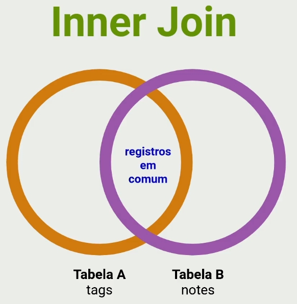

# SQL Query Builder

- O que é um SQL Query Builder - 04:07: Nessa aula aprenderemos o que é um SQL Query Builder e quais as vantagens de utilizá-lo em relação a um banco de dados específico.
  

- Instalando Knex.js - 00:55 - Nessa aula aprenderemos como instalar o Query Builder Knex.js

  - Instalação: [Knex.js - A SQL Query Builder for Javascript](http://knexjs.org/#Installation-node) - `npm install knex --save`, `npm install sqlite3 --save`
    

- Configurando o Knex.js - 04:44 - Nessa aula aprenderemos como configurar o Knex.js para que ele possa se comunicar com o nosso banco de dados SQLite.
  - `npx knex init`
  - Configurar o arquivo: `knexfile.js`
  ```js
  const path = require("path");
  module.exports = {
    development: {
      client: "sqlite3",
      connection: {
        filename: path.resolve(__dirname, "src", "database", "database.db"),
      },
      useNullAsDefault: true,
    },
  };
  ```
- Conceito de <b>Migrations</b> - 02:55 - Nessa aula aprenderemos os conceitos de Migrations suas vantagens e seus métodos (`UP` e `DOWN`)

  - é uma forma de versionar a base de dados
  - migrations trabalha na manipulação da base de dados: criando, alterando ou removendo.
  - Métodos de uma Migrations:
    - <b>UP:</b> método responsável por criar ou alterar algo no banco de dados
    - <b>DOWN:</b> responsável pelo rollback, ou seja, responsável por desfazer as alterações realizadas pela migration.

- Migrations para Notes - 08:49 - Nessa aula criamos a migration do projeto utilizando Knex e executaremos ela para que as tabelas sejam inseridas no banco de dados.

  - No terminal executar o comando: `npx knex migrate:make createNotes`
  - Criar a tabela: `npx knex migrate:latest`
  - Adicionar no package.json o script: "migrate": "knex migrate:latest"
  - Rodar o script: `npm run migrate`

- NPM vs NPX - 03:10 - Nessa aula entenderemos a diferença entre usar o NPM e o NPX. Basicamente o NPM é utilizado para instalar pacotes, enquanto o NPX é utilizado para executar pacotes.

  - Node Package Manager (NPM) - é um gerenciador de pacotes para o Node.JS
  - Os pacotes e módulos necessários no projeto Node são instalados usando `npm`
  - E também utilizamos o npm para executar scripts e bibliotecas instaladas.
  - Node Package Execute (NPX) - é um executor de pacotes npm que pode executar qualquer pacote que coce quiser no registro npm sem se quer instalar esse pacote.

- Primary key e Foreign key - 05:22 - Nessa aula entenderemos a diferença entre chave primária e chave estrangeira.

  - A chave primária possui um id único com ela na tabela, já a chave estrangeira faz a referência desse id da chave primária em outras tabelas.
    

- Cardinalidade - 02:32 - Nessa aula aprenderemos o que é Cardinalidade, ou seja a frequência que uma tabela se relaciona com a outra. Para isso, vamos visualizar a estrutura do nosso banco de dados.

- Migrations para Link e Tag - 07:16 - Nessa aula criaremos mais duas migrations em nosso projeto que proverá as tabelas link e tags em nosso banco de dados
  - `npx knex migrate:make createTags`
  - `npx knex migrate:make createLinks`
    
- Cadastrando nota - 09:58 - Nessa aula criaremos uma nova Migration em nosso projeto, para conseguirmos cadastrar as notas diretamente da nossa API.

- Exibindo nota - 04:24 - Nessa aula criaremos a rota para exibir a nota que o usuário cadastrou no Rocketnotes

- Deletando nota - 03:14 - Nessa aula criaremos a rota para deletar a nota em modo cascata em nosso banco de dados.

- Listando notas - 03:28 - Nessa aula criaremos a rota para listar as notas cadastradas em nosso banco de dados incluindo as tags e links.

- Operador Like - 02:14 - Nessa aula aprenderemos como utilizar o operador `like` para buscar valores que contenham partes de uma palavra. Exemplo:

  - Registro no banco: Introdução Nodejs
  - Pesquisa: Nodejs
  - Resultado: Introdução Nodejs

- Filtro WhereIn - 03:21 - Nessa aula utilizaremos o filtro WhereIn para filtrar realmente o que é necessário em nossa busca no banco de dados.

- Conceito de Inner Join - 08:53 - Nessa aula aprenderemos sobre Inner Join para fazer a junção de duas tabelas e trazer um resultado em conjunto desses dados.
  
  
  
  
  

- Aplicando Inner Join - 03:31 - Nessa aula aplicaremos o Inner Join dentro do nosso projeto unificando as tabelas notes e tags.

- Map e Filter - 10:19 - Nessa aula aprenderemos a utilizar a função `map` e `filter` utilizando a ferramenta PlayCode.
  - PlayCode: [PlayCode - Javascript Playground](https://playcode.io/)
    
  - Coleção de dados:

```js
const tags = [
  { id: 1, name: "node", note_id: 1 },
  { id: 2, name: "express", note_id: 1 },
  { id: 3, name: "react", note_id: 1 },
  { id: 4, name: "javascript", note_id: 2 },
  { id: 5, name: "frontend", note_id: 2 },
];
```

  
  

- Obtendo tags da nota - 01:22
- Listando Tags - 06:31
- Testando tudo - 09:02
- Conclusão - 10:17

```

```
